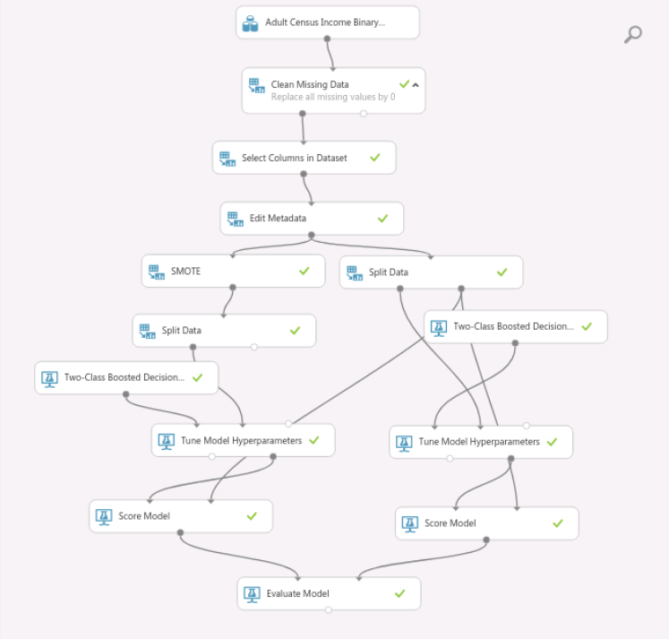
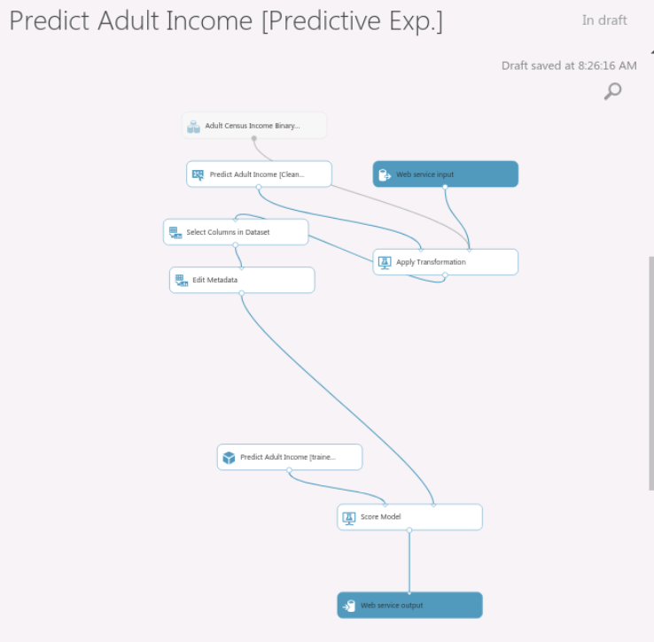

# Predict_Adult_Income
The hands on project on building End-to-end Machine Learning Pipelines with Azure Web Services is divided into the following tasks:

## Task 1: Introduction and Overview
Introduction to the Rhyme interface.
Create a new experiment from the Azure Machine Learning Studio dashboard.
Import and explore the Adult Census data before moving on to pre-processing.

## Task 2: Data Cleaning
Now that you have some idea about the properties of the data, you can start to get it ready for the model.
To account for the missing data, you will substitute all missing values by 0 using the Clean Missing Data module.
The next step is to use the Select Columns in the Dataset module to exclude irrelevant and redundant columns from the data. This is done to reduce the clutter during analysis.
Once the final set of features is ready, use the Edit Metatdata module to convert the specific columns from String types to Categorical Feature types.

## Task 3: Accounting for Class Imbalance
Before creating training and test sets, there is one last pre-processing step: dealing with class imbalance in the dataset.
The number of people earning less than $50K/yr is more than twice of the people earning greater than $50K/yr. What you want to do is upsample the minority class. At this point, it’s very easy to fall into the trap of applying upsampling to your entire dataset. I strongly caution against this approach. The timing of upsampling can affect the generalization ability of a model. Since one of the primary goals of model validation is to estimate how it will perform on unseen data, upsampling correctly is critical.
The right way is to first create the training and test sets and only upsample the training data.
By upsampling only on training data, none of the information in the validation data is being used to create synthetic observations. So these results should be generalizable.
You are now going to train two models. One model will be trained on the upsampled data, and the other with just the original pre-processed data.
Compare how both models perform and come to a conclusion about the efficacy of creating synthetic observations by upsampling the minority class.

## Task 4: Training a Two-Class Boosted Decision Tree Model and Hyperparameter Tuning
Train a two-class boosted decision tree model to predict the income.
Hyperparameter tuning is done using the Tune Model Hyperparameters module.
The parameter sweeps and training will take only 5 minutes to complete.

## Task 5: Scoring and Evaluating the Models
Compare how the two models perform using the Score Model and Evaluate Model modules.
Use the AOC and ROC metrics to evaluate and diagnose your models.

## Task 6: Publishing the Trained Model as a Web Service for Inference
You are now ready to create a web service from an Azure Machine Learning prediction model.
When the experiment run completes successfully, you will be guided to create a Scoring or Prediction Experiment.
The prediction experiment will automatically be created for you with a click. In the prediction experiment, the learner will be replaced with a trained model that has been automatically saved for you from your training experiment.
Once your scoring experiment runs successfully, you will be guided to publish your trained model as a web service.

## [Experiment Link](https://studio.azureml.net/Home/ViewWorkspaceCached/a4803e3d546a4c169ac17fbc5a4b134f#Workspace/Experiments/ListExperiments)

## Snapshots

